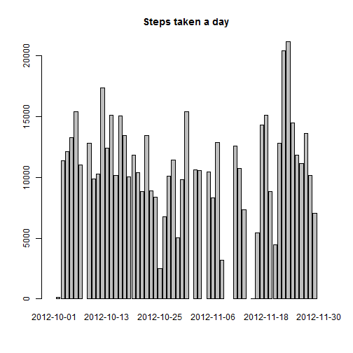
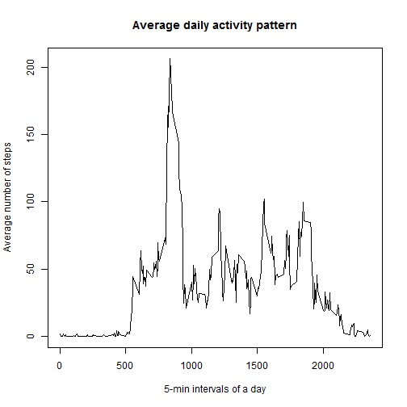
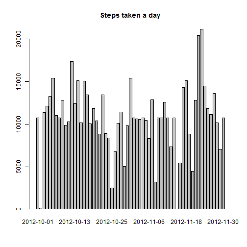
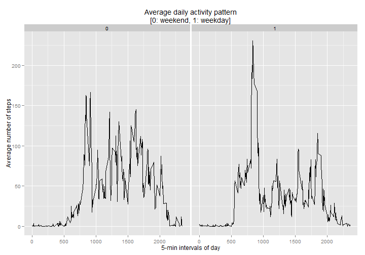

# Reproducible Research: Peer Assessment 1


## Loading and preprocessing the data

```r
data <- read.csv("activity.csv", na.strings = "NA")
data$date <- as.Date(data$date)
```


## What is mean total number of steps taken per day?
How many steps were taken each day?

```r
dataByday <- tapply(data$steps, data$date, sum, simplify=TRUE)
barplot(dataByday, main = "Steps taken a day")
```

 


Mean total number of steps taken per day

```r
mean(dataByday, na.rm=TRUE)
```

```
## [1] 10766
```


Median total number of steps taken per day

```r
median(dataByday, na.rm=TRUE)
```

```
## [1] 10765
```


## What is the average daily activity pattern?
Average number of steps during the day in each 5-minute interval

```r
dataByinterval <- aggregate(data$steps, by=list(interval = data$interval),
                            mean, na.rm = TRUE)

plot(dataByinterval$interval, dataByinterval$x, type="l",
     main = "Average daily activity pattern",
     xlab = "5-min intervals of a day", ylab = "Average number of steps")
```

 

Which interval has the highest value?

```r
maxValue <- which.max(dataByinterval$x)
dataByinterval[maxValue, "interval"]
```

```
## [1] 835
```


## Imputing missing values

Total number of rows with missing values

```r
nrow(data) - sum(complete.cases(data))
```

```
## [1] 2304
```

Impute missing values (with mean value of the particular interval)

```r
# Helper function
getGroupMean <- function(groupValue, groupData, groupDataColumn) {
    groupData[groupDataColumn == groupValue, 2]
}

# Same length as data$steps but conatining only means
meanVector <- sapply(data$interval, function(x)
    getGroupMean(x, dataByinterval, dataByinterval$interval))

# Replacing only the missing
missing <- is.na(data$steps)
dataFilled <- data
dataFilled[missing, 1] <- meanVector[missing]
```

How many steps were taken each day? (with imputed data)

```r
dataByday <- tapply(dataFilled$steps, dataFilled$date, sum, simplify=TRUE)
barplot(dataByday, main = "Steps taken a day")
```

 

Mean total number of steps taken per day (with imputed data)

```r
mean(dataByday)
```

```
## [1] 10766
```

Median total number of steps taken per day (with imputed data)

```r
median(dataByday)
```

```
## [1] 10766
```

We can see in the figure that the missing values got replaced. It is clear that the total number of steps is increased because of the more data.
The mean value of the imputed data set is basically same as the mean value before. The median value has increased but by only a bit. These are not surpiring results as we have removed the missing values in our previous calculations.
(Also, further inspection shows that the number of missing records is the same for each interval.)

## Are there differences in activity patterns between weekdays and weekends?

```r
# localization
Sys.setlocale(category = "LC_TIME", locale = "C")
```

```
## [1] "C"
```

```r
# creating weekday column
dataFilled$date <- as.Date(dataFilled$date)
dataFilled$day <- weekdays(dataFilled$date)
dataFilled$weekday <- 1
dataFilled[dataFilled$day == "Saturday" | dataFilled$day == "Sunday",
           "weekday"] <- 0
dataFilled$weekday <- as.factor(dataFilled$weekday)

# aggregating
dataFilledByinterval <- 
    aggregate(dataFilled$steps, FUN=mean,
              by=list(interval = dataFilled$interval,
                      weekday= dataFilled$weekday))

library(ggplot2)
g <- ggplot(dataFilledByinterval, aes(interval, x))
g + geom_line() +
    facet_grid(. ~ weekday) +
    labs(title = "Average daily activity pattern\n[0: weekend, 1: weekday]") +
    labs(x = "5-min intervals of day") +
    labs(y = "Average number of steps")
```

 

